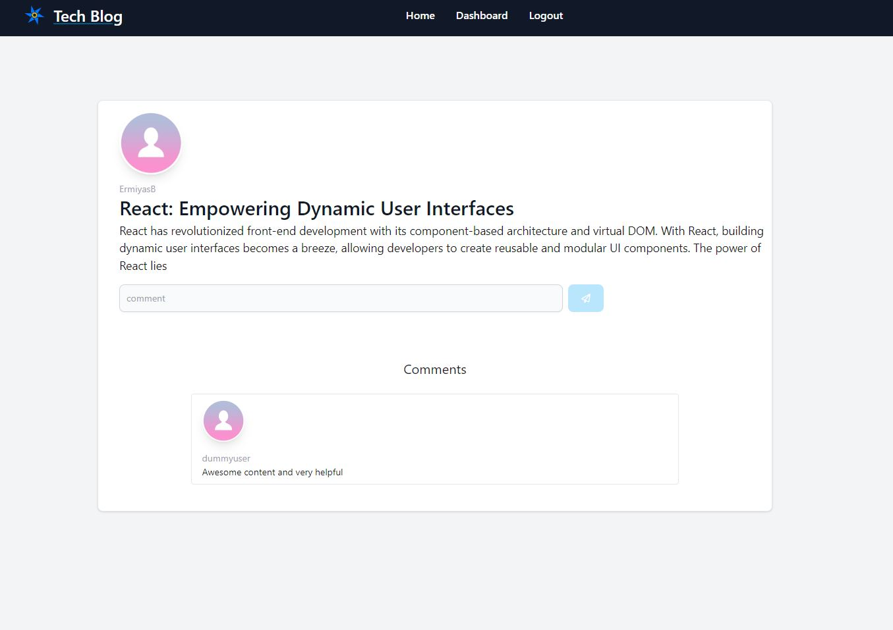

# tech-blog

## Description
- a blog that would let users share their thoughts and others will make comments as a feedback. Users can create, edit or delete blog posts as well as comment on other users' posts.

## Installation
- N/A

## Usage
- use the following link to access tech-blog : https://tech-blog-cms-style-f56d1c666556.herokuapp.com
- Sign up under the login section and login to your account using your credentials
- view posts madse by other users (login is not required)
- to able to make posts or comment on others post you need to login first
- click on a post to make comments
- you can go to your dashboard to edit / delete your posts   

## Credits
- developed by Ermiyas Bekele
- used Flowbites templates using tailwind CSS.
- used Font awesome for icons

